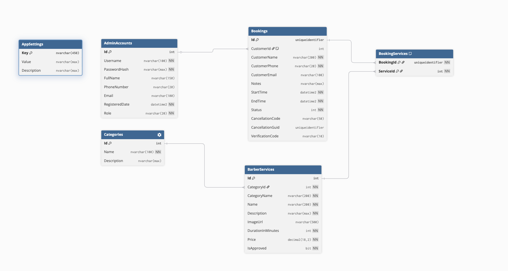

# Barber Booking System

A comprehensive booking management web application built for Barber Shops. This system allows customers to book appointments, and administrators to manage services, bookings, customers, and categories via a robust admin dashboard.

## 🚀 Technologies Used

**Backend Core**

- .NET 9.0 SDK
- ASP.NET Core MVC
- Entity Framework Core 9.0

**Database & Infrastructure**

- SQL Server (running via Docker)
- Docker & Docker Compose

**Frontend**

- Razor Pages / Views
- Tailwind CSS
- DaisyUI (for Admin components)
- Bootstrap (Legacy/Fallback)
- Cally (Date Picker component)

**Libraries & Nuget Packages**

- `BCrypt.Net-Next` (Password hashing)
- `ClosedXML` (Excel exporting for reports)

## 📋 Prerequisites

Before you begin, ensure you have the following installed on your machine:

- [.NET 9.0 SDK](https://dotnet.microsoft.com/download/dotnet/9.0)
- [Docker Desktop](https://www.docker.com/products/docker-desktop) (required for running the SQL Server database)

## ⚙️ Installation & Configuration

1. **Navigate to the project directory:**

   ```bash
   cd BarberBookingWeb
   ```

2. **Configure App Settings:**
   Open `appsettings.json` (or `appsettings.Development.json`) and configure the settings.

   Ensure the **Connection String** points to the local Docker database:

   ```json
   "ConnectionStrings": {
     "DefaultConnection": "Server=localhost,1433;Database=BarberBookingDB;User Id=sa;Password=Admin@123xyz;TrustServerCertificate=True"
   }
   ```

   Configure **SMTP Settings** for Email Notifications:

   ```json
   "EmailSettings": {
     "SmtpServer": "smtp.gmail.com",
     "Port": 587,
     "SenderName": "Barber Shop",
     "SenderEmail": "your-email@gmail.com",
     "Username": "your-email@gmail.com",
     "Password": "your-app-password",
     "EnableSsl": true
   }
   ```

## 🛠️ Running the Application

### 1. Start the Database

The project includes a `docker-compose.yml` file to spin up a SQL Server instance easily. Run the following command from the project root:

```bash
docker-compose up -d
```

_(You can verify it's running via Docker Desktop or by running `docker ps`)_

### 2. Apply Database Migrations

Run Entity Framework Core commands to create the database schema:

```bash
dotnet ef database update
```

### 3. Run the Web Application

You can run the application using the .NET CLI:

```bash
dotnet run
```

Or, for live-reloading during development:

```bash
dotnet watch run
```

## ✨ Key Features

- **Booking Management:** Customers can easily book time slots; admins handle approvals and status changes.
- **Service & Category Management:** Complete CRUD operations for services and categories.
- **Email Notifications:** Automated email confirmations sent on booking status updates.
- **Reporting:** Export booking lists to Excel files.
- **Responsive UI:** Modern admin panel utilizing DaisyUI and semantic colors.

## 🔑 Tài Khoản Mặc Định

Hệ thống tự động tạo tài khoản mặc định khi khởi động lần đầu:

### Admin

| Trường   | Giá trị                |
| -------- | ---------------------- |
| Username | `admin`                |
| Password | `admin123`             |
| Email    | `admin@barbershop.com` |
| Role     | `Admin`                |

> ⚠️ **Lưu ý**: Vui lòng đổi mật khẩu Admin sau khi bàn giao bằng cách cập nhật trực tiếp trong database hoặc bổ sung tính năng đổi mật khẩu.

### Khách Hàng Mẫu (Seed Data)

| Trường   | Giá trị                             |
| -------- | ----------------------------------- |
| Username | Số điện thoại (ví dụ: `0901234567`) |
| Password | `Khang123@#`                        |
| Role     | `Customer`                          |

---

## 📂 Tài Liệu

| Tài liệu                                   | Mô tả                                    |
| ------------------------------------------ | ---------------------------------------- |
| [📦 Danh sách tính năng](spec/features.md) | Liệt kê toàn bộ tính năng đã implement   |
| [📖 Hướng dẫn sử dụng](spec/user-guide.md) | Hướng dẫn sử dụng cho Khách hàng & Admin |

---

## 🗄️ Database Schema


