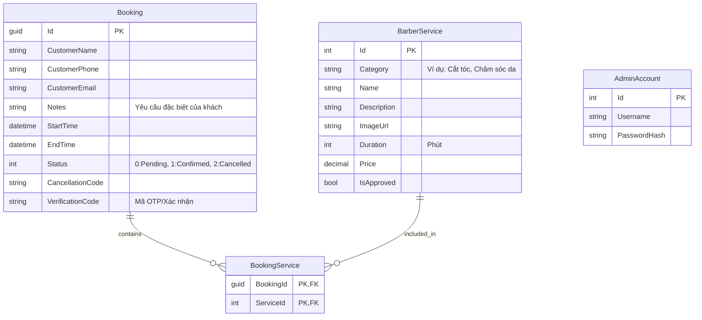

## Context

Dự án đang trong giai đoạn khởi tạo. Chúng ta cần thiết lập lớp dữ liệu (Data Layer) sử dụng ASP.NET Core 9 và Entity Framework Core để lưu trữ thông tin cho hệ thống quản lý tiệm tóc. Cơ sở dữ liệu sẽ sử dụng **SQLite** để đơn giản hóa quá trình phát triển và triển khai cục bộ.

### Database Schema (ERD)

## Goals / Non-Goals

**Goals:**

- Thiết lập cấu trúc DB hỗ trợ quan hệ Many-to-Many giữa `Booking` and `Service`.
- Đảm bảo tính nhất quán dữ liệu (Data Integrity) thông qua các ràng buộc khóa ngoại (Foreign Keys).
- Cung cấp cơ chế Seeding dữ liệu mẫu để hệ thống có thể chạy demo ngay lập tức.
- Quản lý thay đổi DB thông qua EF Core Migrations.

**Non-Goals:**

- Thiết lập các logic nghiệp vụ phức tạp về lịch trình (Scheduling logic).
- Cấu hình phân quyền chi tiết (RBAC).

## Decisions

- **Decision 1: Explicit Join Table for Many-to-Many**: Sử dụng thực thể `BookingService` thay vì để EF Core tự quản lý bảng ẩn.
  - **Rationale**: Dễ dàng mở rộng thêm thông tin vào bảng trung gian.
- **Decision 2: Decimal handles via EF Core**: Sử dụng `decimal` trong code cho `Price`.
  - **Rationale**: Mặc dù SQLite không có kiểu decimal thực thụ, EF Core sẽ ánh xạ nó thành `TEXT` hoặc `REAL` để đảm bảo độ chính xác khi ứng dụng xử lý.
- **Decision 3: GUID for Booking Id**: Sử dụng kiểu `Guid` cho khóa chính của bảng `Bookings`.
  - **Rationale**: Tăng tính bảo mật và định danh toàn cầu.
- **Decision 4: SQLite Database**: Sử dụng SQLite làm hệ quản trị cơ sở dữ liệu.
  - **Rationale**: Loại bỏ sự phụ thuộc vào Docker/SQL Server bên ngoài, giúp project "chỉ cần tải về là chạy" (portable).

## Risks / Trade-offs

- **[Risk] SQLite Concurrency** → **Mitigation**: SQLite hỗ trợ ghi đồng thời hạn chế. Với quy mô tiệm tóc nhỏ, điều này là chấp nhận được. Có thể cấu hình `Journal Mode = WAL` để tăng hiệu năng.
- **[Risk] Foreign Key constraints in SQLite** → **Mitigation**: Mặc định SQLite có thể không bật ràng buộc khóa ngoại. Cần cấu hình trong `DbContext` để đảm bảo tính toàn vẹn dữ liệu.
